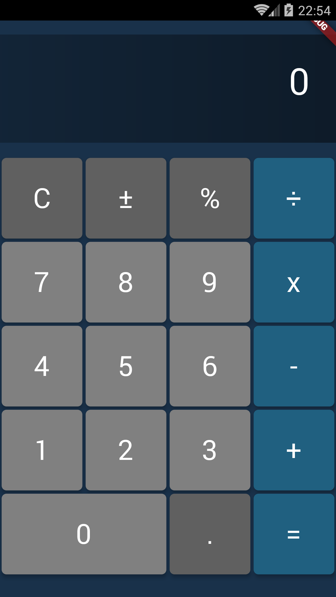
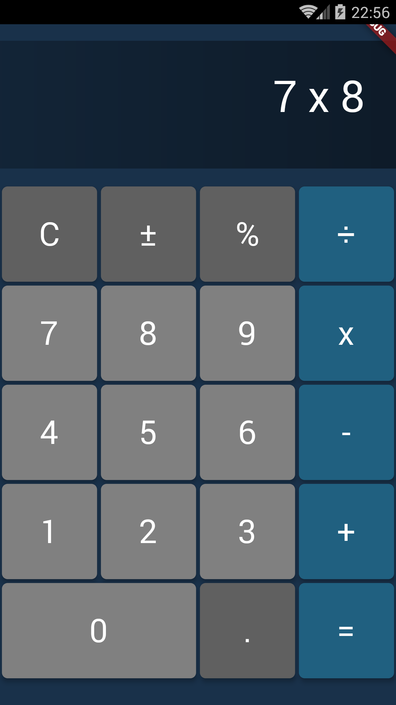
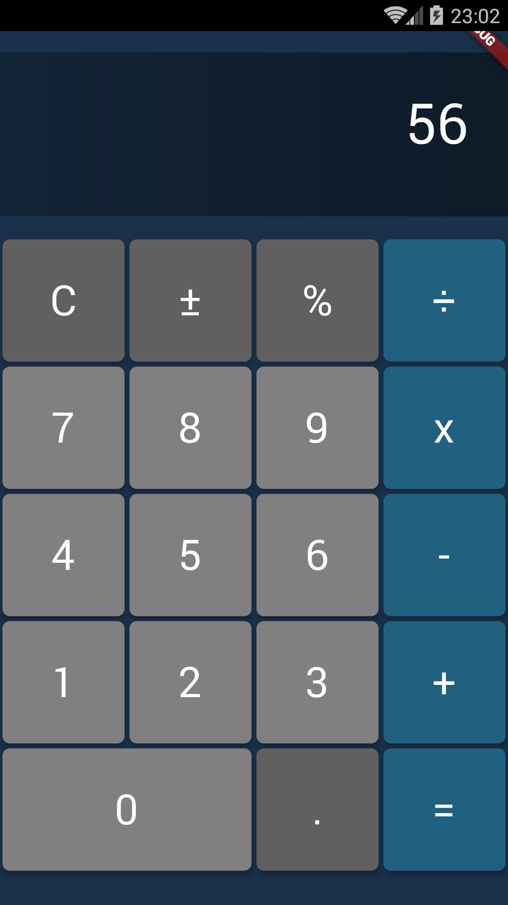

## Description

This project demonstrates how to build simple calculator application in Flutter.

## Student Information

Name: Lê Kiên   

ID: 17021278

## Getting Started

To run this project, follow these steps:

- Clone this project
- Run command `flutter doctor` to list the connected devices to your computer
- Run command `flutter run` to start the project

## Screenshots

   
